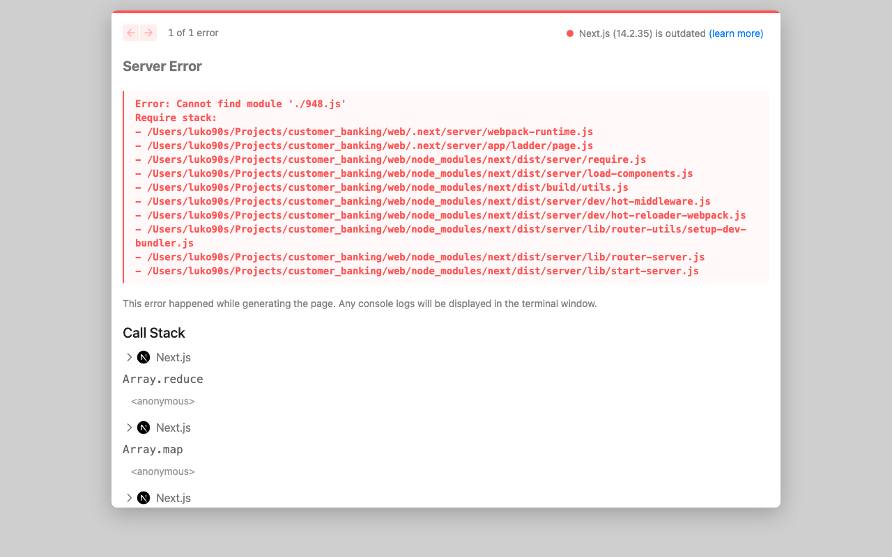

# Savings Growth Planner

**Compare savings accounts, CDs, and contribution strategies with clear,
transparent projections.**

> **Disclaimer:** This application provides educational projections based on
> user-entered assumptions. It does not provide banking, investment, tax, or
> financial advice, and it does not guarantee future returns. It is not a
> bank, holds no accounts, and never asks for personal or account
> information.

This repository began as **Customer Banking System**, a Columbia University
AI Bootcamp module project (preserved unmodified in
[`legacy/M3_Starter_Code/`](legacy/M3_Starter_Code/)). It has since been
rebuilt into a full-stack financial education tool: a tested Python
calculation engine with a menu-driven CLI, and a Next.js web application
deployed on Vercel. The full audit that motivated the rebuild is in
[`docs/AUDIT.md`](docs/AUDIT.md).



---

## Core features

**Web app** (`web/` — Next.js, TypeScript, Tailwind, Recharts, Zod):

- **Savings calculator** — compound growth with monthly contributions
  (beginning- or end-of-month), APR/APY input modes, optional
  inflation-adjusted values, and a stacked principal/contributions/interest
  chart.
- **CD calculator** — maturity projection plus an early-withdrawal scenario
  with a user-supplied penalty assumption; flags when a penalty would eat
  into principal.
- **Compare** — up to three savings/CD scenarios side by side, with liquidity
  called out alongside yield (no single "best" label).
- **CD ladder planner** — templates for 3-rung, 5-rung, and short-term
  ladders, with a maturity/liquidity timeline.
- **Learn** — plain-language explainers (APR vs. APY, compounding, penalties,
  ladders, inflation, liquidity, emergency funds).
- **Methodology** — every formula and assumption, stated plainly.
- Light/dark themes, responsive layouts, keyboard- and screen-reader-friendly
  forms and charts (text summaries accompany every major chart).

**CLI** (`cli/` — Python):

```text
1. Savings calculator
2. CD calculator
3. Savings vs. CD comparison
4. CD ladder planner
```

Both interfaces consume the same validated formulas: the Python engine
(`src/customer_banking/`) and its TypeScript mirror (`web/src/lib/finance.ts`)
are tested against the same expected values and agree to the cent.

## Financial methodology (summary)

- Rates are fractions internally (5% = 0.05); the UI accepts percents.
- **APR → APY:** `APY = (1 + APR/m)^m − 1` for `m` compounding periods/year.
- **Monthly rate from APY:** `(1 + APY)^(1/12) − 1` — exact for any internal
  compounding frequency, because APY already encodes compounding.
- **Savings:** month-by-month simulation; contributions modeled as ordinary
  annuity (end of month, default) or annuity due (beginning of month).
- **CDs:** `FV = P·(1 + i)^n`; early-withdrawal penalty = *k* months of
  interest on the balance at withdrawal (user-supplied *k*; real bank terms
  vary and the UI says so).
- **Inflation:** real value = nominal / (1 + π)^years; real rates use the
  exact Fisher relation.
- **Rounding:** all math at full float precision; rounded to cents only at
  display time (banker's rounding in Python, `Intl.NumberFormat` on the web).
- No taxes or fees are modeled; no live rates are fetched or implied.

Full write-up: the app's **/methodology** page and [`docs/AUDIT.md`](docs/AUDIT.md).

## Repository architecture

```text
customer_banking/
├── src/customer_banking/   # Python engine: models, rates, savings, cd, ladder,
│                           # validation, formatting (zero runtime deps)
├── tests/                  # pytest suite (54 tests)
├── cli/                    # menu-driven CLI (savings-planner entry point)
├── web/                    # Next.js app (App Router, src/ layout)
│   ├── src/lib/            # TS engine mirror, schemas, formatting + unit tests
│   ├── src/components/     # calculator fields, charts, summaries, theme
│   ├── src/app/            # routes: /, /savings, /cd, /compare, /ladder,
│   │                       # /learn, /methodology
│   └── e2e/                # Playwright smoke test
├── legacy/M3_Starter_Code/ # original bootcamp submission (unmodified)
├── docs/AUDIT.md           # full audit and rationale
└── .github/workflows/ci.yml
```

## Python setup

```bash
python3 -m venv .venv && source .venv/bin/activate
pip install -e . -r requirements-dev.txt

savings-planner          # run the CLI (or: python -m cli.main)
pytest                   # 54 tests
ruff check . && mypy     # lint + strict type-check
```

## Frontend setup

```bash
cd web
npm install
npm run dev              # http://localhost:3000
npm test                 # Vitest unit tests (47 tests)
npm run typecheck        # tsc --noEmit
npm run lint             # ESLint
npm run build            # production build
npm run e2e              # Playwright (builds and serves automatically)
```

## Vercel deployment

The app deploys as a standard Next.js project with **root directory `web/`**:

1. Import the GitHub repository in Vercel.
2. Set *Root Directory* to `web` (framework preset: Next.js). No environment
   variables are required — there are no secrets, APIs, or server-side data
   sources.
3. Every push to `main` deploys production; pull requests get preview
   deployments automatically.

No `vercel.json` is needed. All routes are statically prerendered.

## Privacy

- No accounts, no sign-in, no cookies, no analytics.
- Calculator inputs never leave the browser — projections are computed
  client-side.
- The app never asks for names, emails, account numbers, credentials, SSNs,
  or any personal financial records.

## Limitations

- Projections hold rates constant; real savings rates are variable.
- Taxes, fees, and institution-specific terms are not modeled.
- Early-withdrawal penalties are user assumptions, not quotes.
- Supported display currencies: USD, EUR, GBP, CAD.

## What this project demonstrates

Python (OOP → functional core, `src/` packaging, Decimal rounding policy),
financial mathematics (compounding, annuities, APR/APY, real returns), input
validation, test-driven development (pytest + Vitest + Playwright, 100+
tests), TypeScript, React, Next.js App Router, responsive design, data
visualization with accessibility parity, CI/CD with GitHub Actions, Vercel
deployment, and consumer financial education writing.

## Roadmap

- Scenario save/share via URL state
- Additional display currencies and i18n
- Optional clearly-labeled tax-estimate mode

## License

[MIT](LICENSE)
